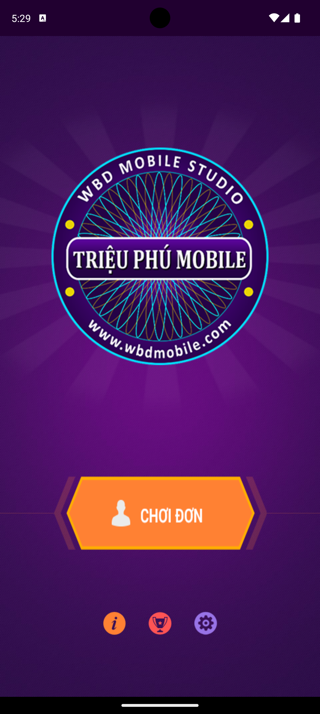
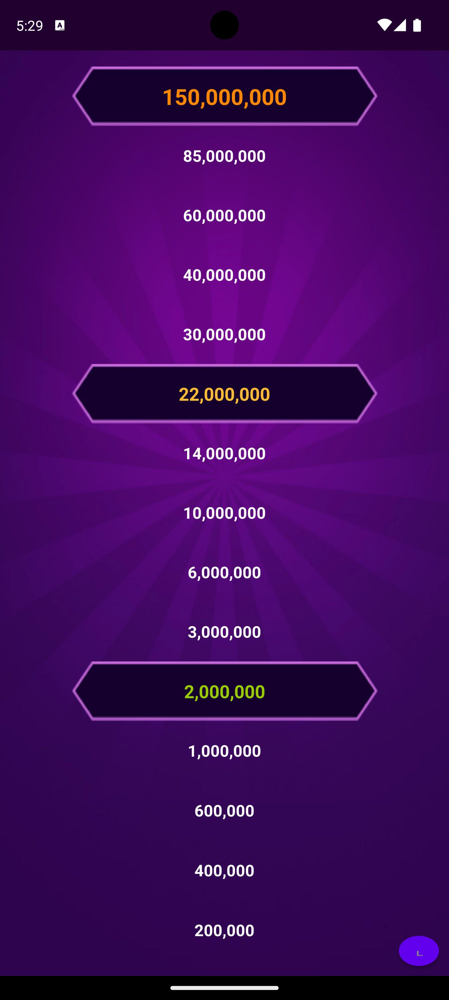
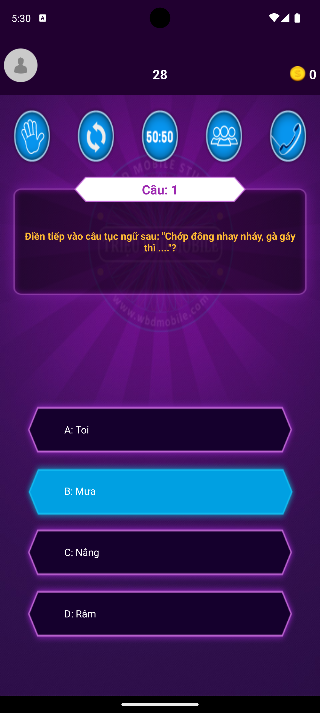
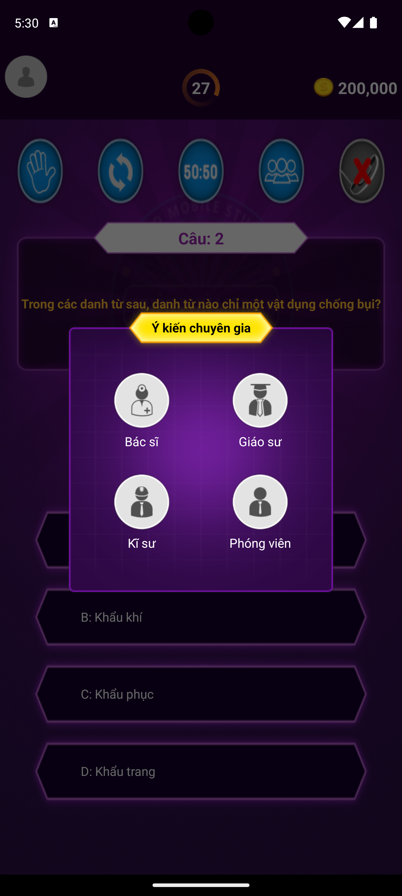
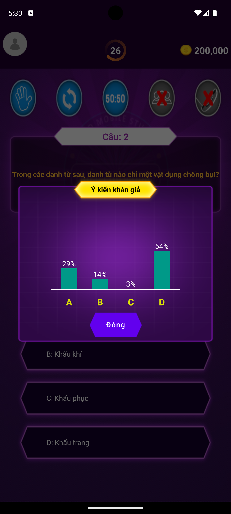
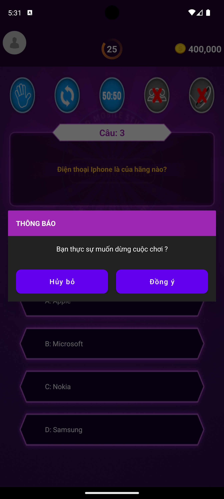
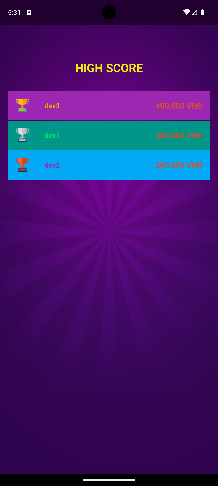

## 💝 Ủng hộ tôi

### Nếu bạn thấy dự án của tôi hữu ích và muốn ủng hộ tôi, hãy quét mã QR bên dưới:

|                                                                              |  |  |  |
|-------------------------------------------------------------------------------------------------------------------------------|-----------------------------------|---------------------------------------------------|-----------------------------------|
| **Momo:&nbsp;&nbsp;&nbsp;&nbsp;&nbsp;&nbsp;&nbsp;&nbsp;&nbsp;&nbsp;&nbsp;&nbsp;&nbsp;&nbsp; 0981054498 - NGUYEN ANH DAT** | **Thank you 🙌**                  | **Techcombank: 1981054498 - NGUYEN ANH DAT**  | **Thank you 🙌**                  |

### Cảm ơn sự hào phóng của bạn! 🙌

---

## Giới thiệu ứng dụng AiLaTrieuPhu

### Mô tả

- Ứng dụng **AiLaTrieuPhu** có ngôn ngữ lập trình là `Android - Java`. Tôi code cơ bản và dễ hiểu, phù hợp với ai mới học. Tôi cũng đã cập nhật, bạn chỉ cần tải về và chạy.
- Ứng dụng **AiLaTrieuPhu** có luật chơi tương tự trò chơi Ai là triệu phú trên truyền hình.
- Ứng dụng **AiLaTrieuPhu** có âm thanh là giọng của **MC Lại Văn Sâm**, giống hoàn toàn với chương trình truyền hình.

#### Màn hình

|   |   |  |  | 
|----------------------------------|-----------------------------------|----------------------------------|----------------------------------|
|  |   |  |  |
